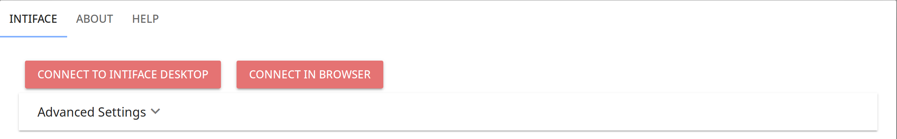
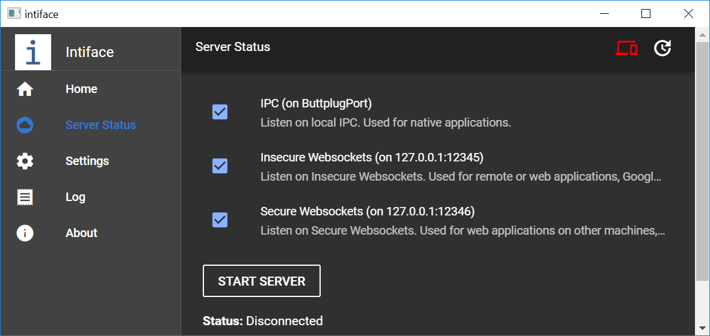
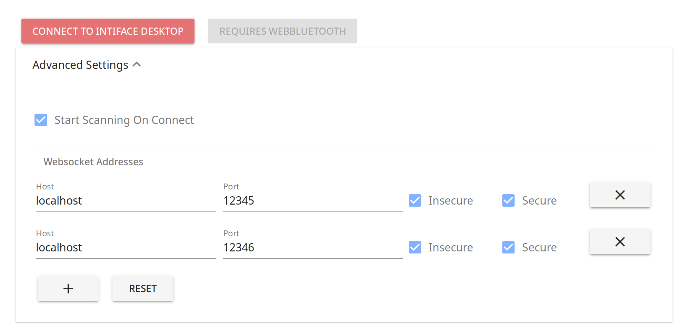
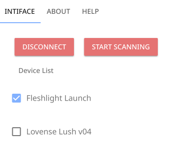

## Connecting to Hardware

Using this app will require connecting to hardware of some kind. This
may be a bluetooth sex toy, a fucking machine controlled over serial
port, or some other type of device.

The steps are as follows:

- Decide whether you using Intiface Desktop or the browser itself (not
  all browsers support this) to talk to hardware.
- Scan for devices
- Once devices are found, make them "active" so the application can
  use them.

### Connection Interface

Connections will begin by using the Connection portion of the
interface.

You have two options for connections:

* [Intiface Desktop](https://intiface.com/desktop), a cross platform
  application for connecting to Bluetooth/Serial/etc... devices.
* In Browser Connection, which allows you to connect to bluetooth
  devices if you are using [Google Chrome](https://chrome.google.com)
  derived web browsers.

#### Via Intiface Desktop

For Intiface Desktop, you will need to use either Insecure or Secure
Websockets.

This application will, by default, try to connect to all of the
default address/ports on localhost. This should work for most
installations.

If you are using **Google Chrome** and connecting to a copy of
Intiface Desktop on the same machine as your browser, you can use
_Insecure Websockets_ and do not need to worry about secure
certificates.

If you are using **Firefox** or **Safari**, you will need to use
Secure Websockets and go through the secure certificate
generation/acceptance steps in Intiface Desktop.

#### Via the Browser

If you are using **[Google Chrome](https://chrome.google.com)** on
Windows, Mac, Linux, ChromeOS, or Android, or
**[WebBLE](https://apps.apple.com/us/app/webble/id1193531073)** on
iPhone/iPad (iOS), you can also use your hardware in the browser
without using an outside program. Click the "Connect In Browser"
button.

If you are not using a browser that has the proper requirements (in
this case, WebBluetooth), the button will be disabled and will read
_"Requires WebBluetooth"_.

#### Advanced Settings

_Advanced Settings_ allows you to change how certain portions of
connecting work.

- By default, we will scan for devices on connect. This can be turned
  off here.
- If you need to connect to Intiface Desktop on another machine or
  port, that can also be set up here. All interfaces and ports that
  are listed will be tried, and the first successful connection will
  proceed. You can also choose whether _insecure_ (ws://) or _secure_
  (wss://) connections will be used.

### Discovering and Using Hardware

Once you have connected, either via Intiface Desktop or In Browser,
you can then _scan for devices_. By default, this will happen
automatically when you connect.

When devices are found, they will show up in the _Devices_ portion of
the dialog, as shown above. 

To use a device in the application, click on the checkbox next to the
device. This will mark is as "active", so that the application can
access and use it.

Unchecking the box should stop the hardware from whatever it is doing,
and no longer allow it to take commands from the application.

### Disconnecting

To disconnect, hit the _Disconnect_ button. This will disconnect and
should cause all toys to stop whatever commands they were taking (i.e.
vibrations should stop running, etc...)

### Troubleshooting

#### Why can't I connect to Intiface Desktop?

Here's a few things to check and try if you can't connect to Intiface
Desktop.

- Is the server running? Check the _Server Status_ page on Intiface
  desktop and make sure it's running.
- Do you have either _Insecure Websockets_, _Secure Websockets_ or
  both selected on Intiface Desktop? IPC won't work for web.
- If you are using _Firefox_ or _Safari_, you will have to use _Secure
  Websockets_. Have you accepted the cert in your browser yet? This
  can be done in Intiface Desktop in _Settings -> Other Settings ->
  Run Certificate Setup_.

#### Why does the browser button show _Requires WebBluetooth_?

If your browser does not support WebBluetooth, you will see a
_Requires Bluetooth_ button where _Connect In Browser_ would normally
be. This is because your browser cannot connect to Bluetooth hardware,
and therefore won't be able to provide hardware access to the
application.

Currently, browsers supporting WebBluetooth are:

- [Google Chrome](https://chrome.google.com)
- [WebBLE](https://apps.apple.com/us/app/webble/id1193531073)

#### I've connected, why can't I see my hardware listed?

- Did you scan for hardware?
- Is your hardware on and close to your computer or phone?
- Assuming you are using Bluetooth hardware, is your bluetooth on?
- If your hardware is not being listed, and you are using Intiface
  Desktop, did Intiface Desktop show any errors in its log panel?

#### None of this answers my question, how can I ask for help?

Here's a few places you can ask questions and get help in real time:

- [Metafetish Forums](https://metafetish.club)
- [Metafetish Discord Chat Server](https://discord.buttplug.io)
